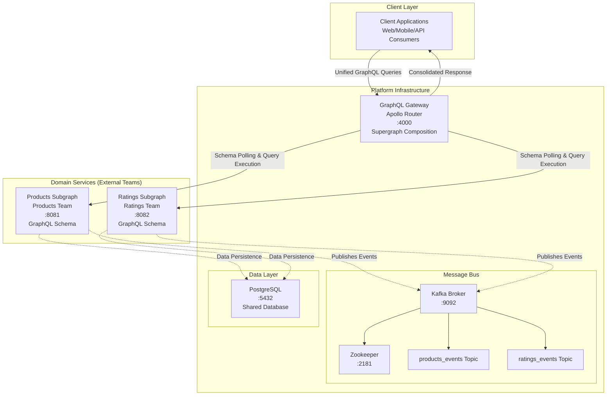

# Platform Infrastructure Design Document

## Overview

The platform infrastructure provides a comprehensive foundation for GraphQL Federation architecture, where domain teams develop independent GraphQL subgraphs that are composed into a unified supergraph. The Apollo Router-based GraphQL Gateway orchestrates queries across multiple subgraphs and returns consolidated responses to client applications. The platform also provides shared infrastructure including Apache Kafka for event-driven communication between domains and PostgreSQL for data persistence. All components are orchestrated through Docker Compose with environment-based configuration for flexibility across different deployment environments.

## Architecture



## Components and Interfaces

### GraphQL Gateway (Apollo Router)

**Purpose**: Acts as the single entry point for all GraphQL operations, composing multiple domain subgraphs into a unified supergraph and orchestrating query execution across services.

**Configuration**:
- Port: 4000 (configurable via `GRAPHQL_GATEWAY_PORT`)
- Subgraph polling interval: 30 seconds (configurable)
- Service URLs configured via environment variables

**Key Features**:
- **Schema Composition**: Automatically polls subgraph services for schema updates and composes them into a supergraph
- **Query Planning**: Analyzes incoming queries and creates optimal execution plans across multiple subgraphs
- **Request Orchestration**: Routes query fragments to appropriate subgraph services and coordinates execution
- **Response Consolidation**: Merges responses from multiple subgraphs into a single, unified response for the client
- **Federation Directives**: Supports GraphQL Federation directives for entity relationships across subgraphs

**Environment Variables**:
```
PRODUCTS_SERVICE_URL=http://products-service:8081
RATINGS_SERVICE_URL=http://ratings-service:8082
GRAPHQL_GATEWAY_PORT=4000
APOLLO_SCHEMA_CONFIG_EMBEDDED=true
```

### Message Bus (Apache Kafka)

**Purpose**: Provides reliable, scalable event streaming for domain-to-domain communication, enabling loose coupling between Products and Ratings teams while maintaining data consistency.

**Configuration**:
- Broker port: 9092
- Zookeeper port: 2181
- Replication factor: 1 (single broker setup)
- Retention policy: 7 days default

**Topics**:
- `products_events`: Product domain events (product.created, product.updated, product.deleted, product.price_changed)
- `ratings_events`: Ratings domain events (rating.submitted, rating.updated, rating.deleted, rating.moderated)

**Key Features**:
- **Domain Event Publishing**: Products and Ratings services publish domain events for cross-team consumption
- **Event-Driven Architecture**: Enables eventual consistency between domains without tight coupling
- **Message Persistence**: Ensures events are not lost and can be replayed for new consumers
- **Consumer Groups**: Allows multiple instances of consuming services for scalability
- **Event Sourcing Support**: Maintains complete event history for audit and replay capabilities

**Environment Variables**:
```
KAFKA_BROKER_ID=1
KAFKA_ZOOKEEPER_CONNECT=zookeeper:2181
KAFKA_ADVERTISED_LISTENERS=PLAINTEXT://kafka:9092
KAFKA_OFFSETS_TOPIC_REPLICATION_FACTOR=1
```

### PostgreSQL Database

**Purpose**: Provides shared relational data storage that both Products and Ratings domains can use, with proper database isolation and shared infrastructure management.

**Configuration**:
- Port: 5432
- Databases: `products_db`, `ratings_db`, `platform_db`
- Connection pooling: Enabled
- Persistent storage via Docker volumes

**Key Features**:
- **Multi-Database Support**: Separate databases for Products and Ratings domains to maintain data isolation
- **Shared Infrastructure**: Single PostgreSQL instance managed by platform team, reducing operational overhead
- **Connection Pooling**: Optimized connection management for multiple domain services
- **Data Persistence**: Reliable storage with backup and recovery capabilities
- **Schema Management**: Support for independent schema evolution per domain database

**Environment Variables**:
```
POSTGRES_MULTIPLE_DATABASES=products_db,ratings_db,platform_db
POSTGRES_USER=platform_user
POSTGRES_PASSWORD=platform_password
POSTGRES_HOST=postgres
POSTGRES_PORT=5432
```

## Data Models

### GraphQL Federation Schema Composition

The GraphQL Gateway composes subgraph schemas using Apollo Federation directives to create entity relationships across domains:

**Products Subgraph Schema** (Products Team):
```graphql
type Product @key(fields: "id") {
  id: ID!
  name: String
  description: String
}

type Query {
  product(id: ID!): Product
}
```

**Ratings Subgraph Schema** (Ratings Team):
```graphql
directive @key(fields: String!) on OBJECT | INTERFACE
directive @extends on OBJECT | INTERFACE
directive @external on FIELD_DEFINITION
directive @requires(fields: String!) on FIELD_DEFINITION
directive @provides(fields: String!) on FIELD_DEFINITION

# Product type with key field for federation - this service only provides rating information
type Product @key(fields: "id") {
  id: ID!
  averageRating: Float
  reviewCount: Int
  ratingDistribution: RatingDistribution
}

# Rating distribution type showing count of ratings by star level
type RatingDistribution {
  oneStar: Int!
  twoStar: Int!
  threeStar: Int!
  fourStar: Int!
  fiveStar: Int!
  total: Int!
  mostCommonRating: Int
  hasPositiveRatings: Boolean!
  hasNegativeRatings: Boolean!
  diversityScore: Float
}

# Query type for direct rating statistics queries
type Query {
  # Get a product by ID (for federation and direct queries)
  product(id: ID!): Product
  # Get rating statistics for a specific product
  productRatingStats(productId: ID!): ProductRatingStats
  # Get top-rated products
  topRatedProducts(limit: Int = 10): [ProductRatingStats!]!
  # Get most reviewed products
  mostReviewedProducts(limit: Int = 10): [ProductRatingStats!]!
  # Get overall rating statistics
  overallRatingStats: OverallRatingStats
}

# Standalone product rating statistics type
type ProductRatingStats {
  productId: ID!
  averageRating: Float
  reviewCount: Int!
  ratingDistribution: RatingDistribution
  lastUpdated: String
}

# Overall system rating statistics
type OverallRatingStats {
  totalProducts: Int!
  totalReviews: Int!
  overallAverageRating: Float
  productsWithRatings: Int!
}
```

**Composed Supergraph** (Client View):
```graphql
type Product {
  id: ID!
  # From Products subgraph
  name: String
  description: String
  # From Ratings subgraph
  averageRating: Float
  reviewCount: Int
  ratingDistribution: RatingDistribution
}

type RatingDistribution {
  oneStar: Int!
  twoStar: Int!
  threeStar: Int!
  fourStar: Int!
  fiveStar: Int!
  total: Int!
  mostCommonRating: Int
  hasPositiveRatings: Boolean!
  hasNegativeRatings: Boolean!
  diversityScore: Float
}

type ProductRatingStats {
  productId: ID!
  averageRating: Float
  reviewCount: Int!
  ratingDistribution: RatingDistribution
  lastUpdated: String
}

type OverallRatingStats {
  totalProducts: Int!
  totalReviews: Int!
  overallAverageRating: Float
  productsWithRatings: Int!
}

type Query {
  # From Products subgraph
  product(id: ID!): Product
  # From Ratings subgraph
  productRatingStats(productId: ID!): ProductRatingStats
  topRatedProducts(limit: Int = 10): [ProductRatingStats!]!
  mostReviewedProducts(limit: Int = 10): [ProductRatingStats!]!
  overallRatingStats: OverallRatingStats
}
```

**Note**: Write operations (create, update, delete) are handled by separate gRPC endpoints within each domain service and are outside the scope of this platform infrastructure. The GraphQL gateway provides read-only access to composed data across domains.

### Kafka Message Formats

**Products Events**:
```json
{
  "eventType": "product.created|product.updated|product.deleted",
  "timestamp": "2024-01-01T00:00:00Z",
  "productId": "uuid",
  "data": {
    "name": "string",
    "description": "string",
    "price": "number"
  }
}
```

**Ratings Events**:
```json
{
  "eventType": "rating.created|rating.updated|rating.deleted",
  "timestamp": "2024-01-01T00:00:00Z",
  "ratingId": "uuid",
  "productId": "uuid",
  "data": {
    "userId": "uuid",
    "score": "number",
    "comment": "string"
  }
}
```

## Error Handling

### GraphQL Gateway Error Handling

1. **Schema Composition Errors**: Log detailed error messages and fail startup if schemas cannot be composed
2. **Subgraph Unavailability**: Return partial results with error extensions indicating which services are down
3. **Network Timeouts**: Implement circuit breaker pattern with configurable timeout values
4. **Invalid Queries**: Return standard GraphQL error responses with detailed field-level errors

### Kafka Error Handling

1. **Broker Unavailability**: Implement exponential backoff retry logic for producer connections
2. **Topic Creation Failures**: Auto-create topics with default configurations if they don't exist
3. **Message Serialization Errors**: Log errors and send to dead letter topic for manual review
4. **Consumer Lag**: Monitor consumer group lag and alert when thresholds are exceeded

### PostgreSQL Error Handling

1. **Connection Failures**: Implement connection pooling with automatic retry and failover
2. **Database Unavailability**: Queue operations and retry when database becomes available
3. **Schema Migration Errors**: Provide rollback capabilities and detailed error logging
4. **Constraint Violations**: Return meaningful error messages for data integrity issues

## Testing Strategy

### Integration Testing

1. **Docker Compose Health Checks**: Verify all services start successfully and pass health checks
2. **GraphQL Schema Composition**: Test schema composition with mock subgraph services
3. **Kafka Topic Creation**: Verify topics are created with correct configurations
4. **Database Connectivity**: Test database connections and basic CRUD operations

### End-to-End Testing

1. **GraphQL Query Routing**: Test queries that span multiple subgraphs
2. **Message Flow**: Test message publishing and consumption across topics
3. **Service Discovery**: Test GraphQL Gateway's ability to discover and poll subgraph schemas
4. **Configuration Management**: Test environment variable configuration across all services

### Performance Testing

1. **GraphQL Gateway Throughput**: Load test with concurrent queries to measure response times
2. **Kafka Message Throughput**: Test message publishing and consumption rates under load
3. **Database Connection Pooling**: Test concurrent database connections and query performance
4. **Resource Utilization**: Monitor CPU, memory, and network usage under various load conditions

### Monitoring and Observability

1. **Health Check Endpoints**: Implement `/health` endpoints for all services
2. **Metrics Collection**: Expose Prometheus-compatible metrics for monitoring
3. **Logging Strategy**: Structured logging with correlation IDs for request tracing
4. **Alerting Rules**: Define alerts for service unavailability, high error rates, and resource exhaustion